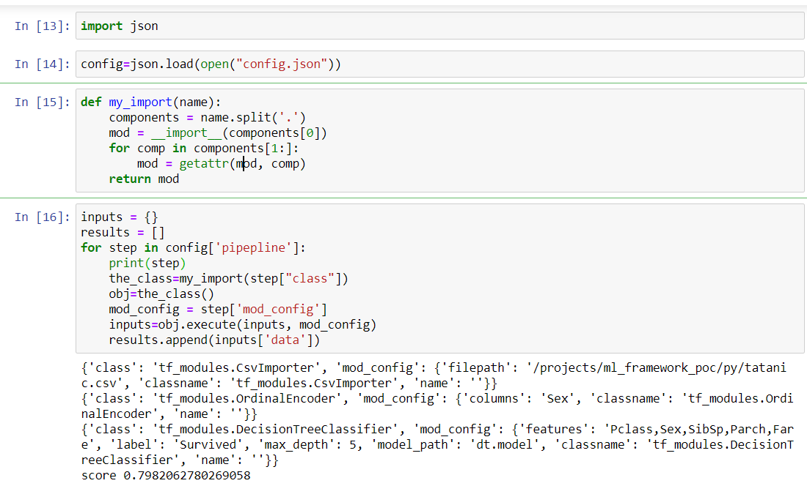

# UI

First, let's look at the UI.


From this UI, we can generate a config.json file which is consumed by the backend.

# Backend

The backend will use this config.json to build a model.





# Unit Test

As we can see, each time we execute the workflow, a configuration file will be generated. We can save those files and use them in unit test. 


The unit test is quite easy to write:


```python 
import unittest
import job_executor

class TestStringMethods(unittest.TestCase):

    def test_1(self):
        job_executor.execute("test_case_1_lr.json")

    def test_2(self):
        job_executor.execute("test_case_2_decision_tree.json")

if __name__ == '__main__':
    unittest.main()
```

