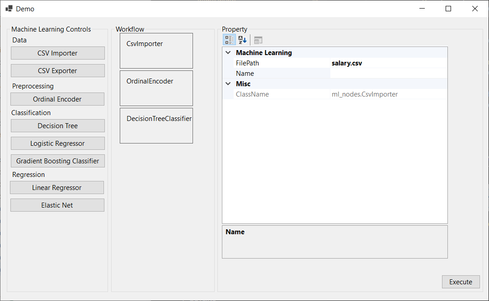

# Build Status & Coverage & Maintainability & License

[](https://travis-ci.org/EricWebsmith/ml_framework_poc)
[](https://ci.appveyor.com/project/juwikuang/ml-framework-poc)
[](https://circleci.com/gh/EricWebsmith/ml_framework_poc)
[](https://coveralls.io/github/EricWebsmith/ml_framework_poc?branch=master)

# UI

First, let's look at the UI.



From this UI, we can generate a config.json file which is consumed by the backend.


You can click the buttons in the left to add workflow nodes to the workflow section in the middle.


You can right click the workflow nodes to move up, move down or delete the workflow node.


In the property section, the properties of the nodes are set.


The UI is release [here](https://github.com/EricWebsmith/ml_framework_poc/releases/tag/1).

Or you can write the config.json file yourself, as follow:

```json
{
    "model_id": "13254654", 
    "model_name": "my_name", 
    "pipepline": [
        {
            "class": "tf_modules.CsvImporter", 
            "mod_config": {
                "filepath": "/projects/ml_framework_poc/py/tatanic.csv", 
                "classname": "tf_modules.CsvImporter", 
                "name": ""
            }
        }, 
        {
            "class": "tf_modules.OrdinalEncoder", 
            "mod_config": {
                "columns": "Sex", 
                "classname": "tf_modules.OrdinalEncoder", 
                "name": ""
            }
        }, 
        {
            "class": "tf_modules.DecisionTreeClassifier", 
            "mod_config": {
                "features": "Pclass,Sex,SibSp,Parch,Fare", 
                "label": "Survived", 
                "max_depth": 5, 
                "model_path": "dt.model", 
                "classname": "tf_modules.DecisionTreeClassifier", 
                "name": ""
            }
        }
    ]
}
```


# Backend

The backend will use this config.json to build a model.


```pyhton
python job_executor.py config.json
```


# Unit Test

As we can see, each time we execute the workflow, a configuration file will be generated. We can save those files and use them in unit test. 


The unit test is quite easy to write:


```python 
import unittest
import job_executor

class MLTests(unittest.TestCase):

    def test_1(self):
        job_executor.execute("test_case_1_lr.json")

    def test_2(self):
        job_executor.execute("test_case_2_decision_tree.json")

if __name__ == '__main__':
    unittest.main()
```

